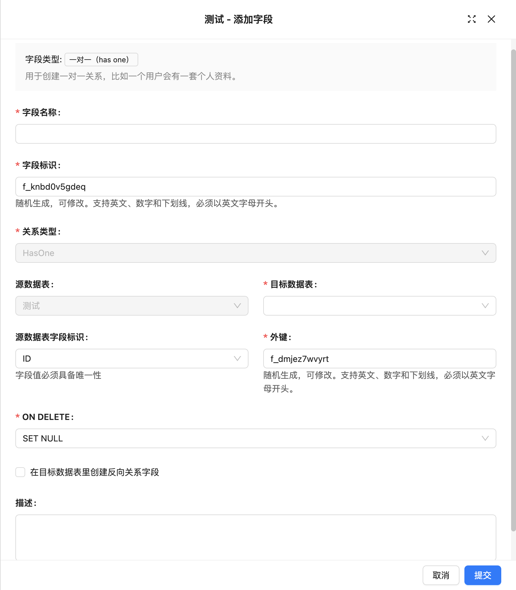

# 一对一(has one)

### 介绍

### 字段配置

### 界面配置

待补充

### 使用参数
#### Source Collection
源表，指的是当前字段所在的表。

#### Target Collection
目标表，即与哪个表进行关联。

#### Foreign Key
外键，用于在两个表之间建立关联。对于一对一关系，外键可以放在源表或目标表中。如果外键表示的是“某个”关系（例如“一对一”中的一方拥有另一方），将外键放在目标表会更加合适；如果是表示“隶属关系”或“归属关系”，则应该将外键放在源表中。

#### Source key <- Foreign Key（外键在目标表）
外键约束引用的字段必须具有唯一性。当外键位于目标表时，通常表示“有一个”关联。

#### Target key <- Foreign Key（外键在源表）
外键约束引用的字段也必须具有唯一性。当外键放置在源表时，表示的是“隶属关系”或“所属关系”。

#### ON DELETE
ON DELETE 是在父表记录被删除时对相关子表中外键引用的操作规则。它是定义外键约束时的一个选项，常见的 ON DELETE 选项包括：

- **CASCADE**：当父表中的记录被删除时，自动删除子表中与之关联的所有记录。
- **SET NULL**：当父表中的记录被删除时，将子表中与之关联的外键值设置为 NULL。
- **RESTRICT**：这是默认选项，当试图删除父表中的记录时，如果子表中存在与之关联的记录，则拒绝删除父表中的记录。
- **NO ACTION**：与 RESTRICT 相似，当子表存在与父表记录关联的数据时，拒绝删除父表中的记录。