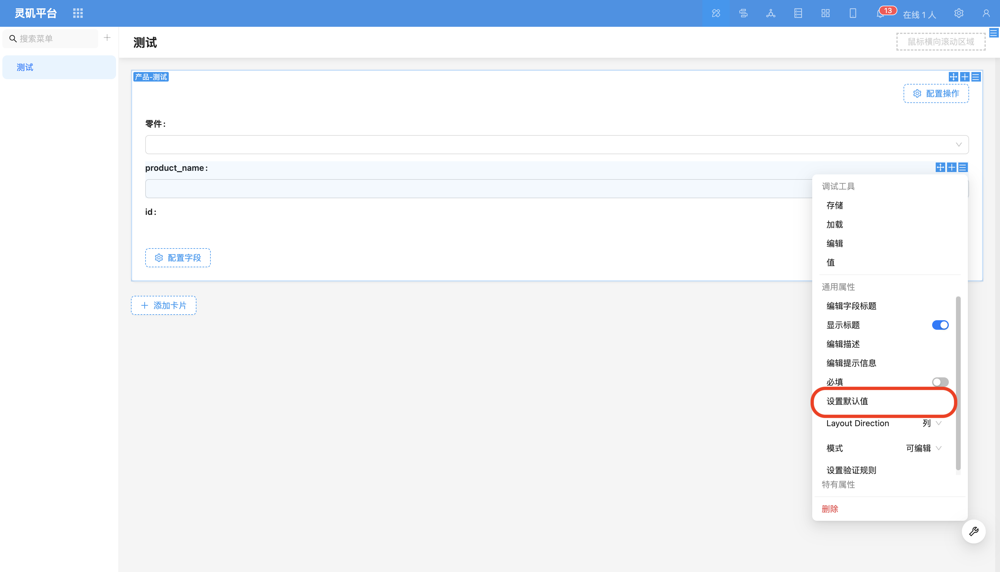
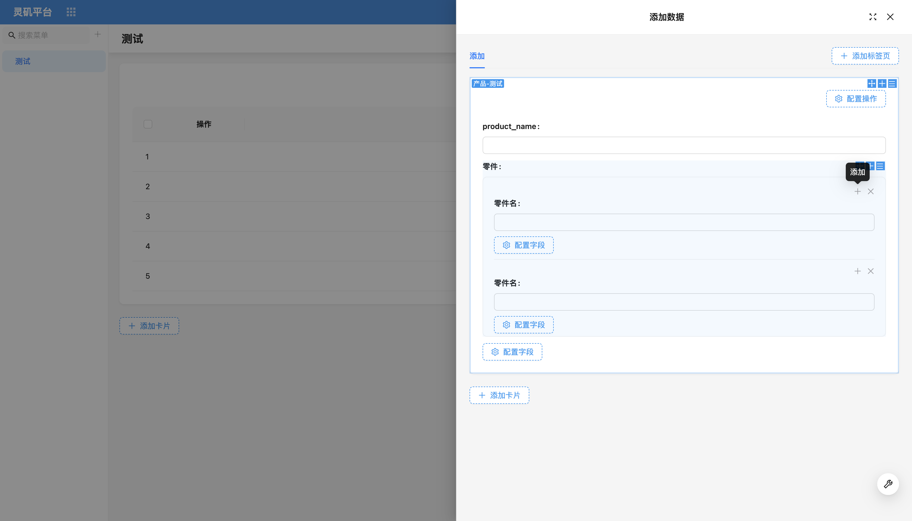
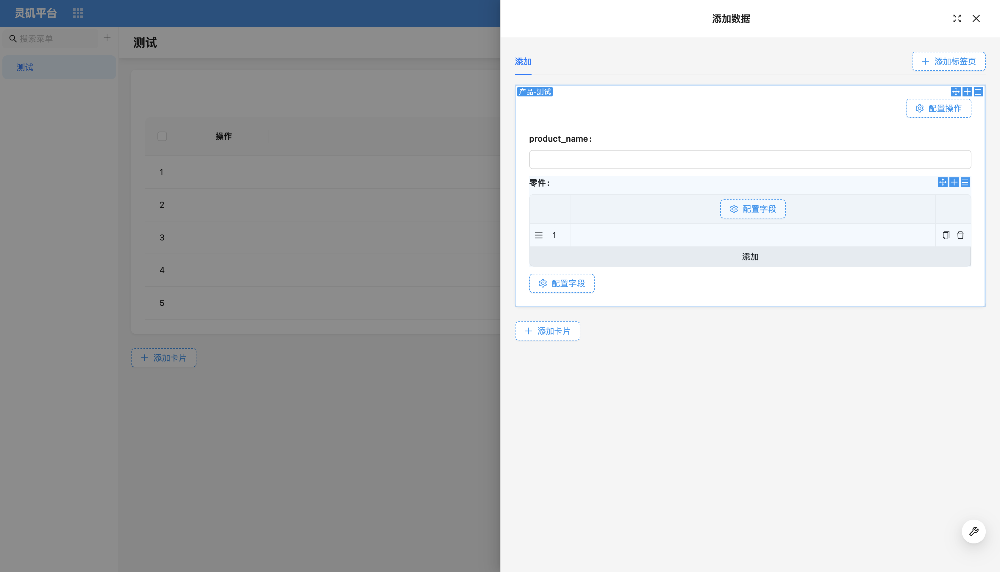
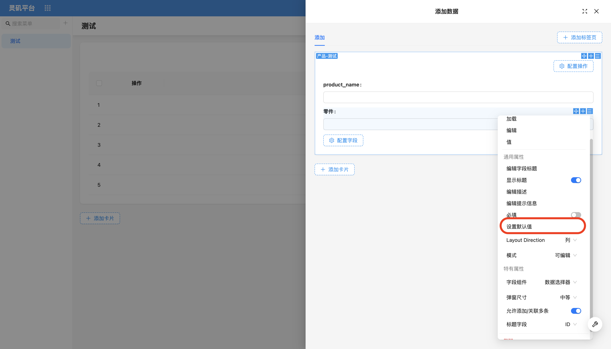
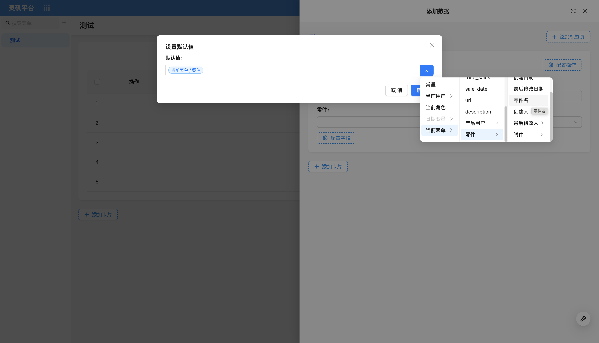

# 默认值

### 概述

默认值是字段在新建状态下的初始值，可以在数据表或新增表单区块中配置，支持常量或变量作为默认值。

### 哪些地方可以配置默认值？

#### 数据表字段
在数据表配置字段时，可以为字段设置默认值。


#### 新增表单的字段
大部分字段都支持设置默认值。


#### 子表单的添加
在新增或编辑表单中的子表单字段，新添加的数据会应用默认值。




但编辑已有数据时，若数据为空，也不会被默认值填充。
<!-- TODO: 添加图片 -->


#### 关系数据的默认值
仅支持**「多对一」和「多对多」**关系字段。
需要使用选择器组件（如 Select、RecordPicker）才能生效。



### 默认值变量

#### 支持的变量类型包括：

日期变量（当前日期、时间等）
当前用户（用户 ID、姓名等）
当前记录（仅在已有数据时可用）
当前表单（仅限于表单字段）
当前对象（子表单里的每一行数据对象）
表单选中记录（用于「Table 区块 + Add Record 表单」）

更多内容参考[变量](../../variable.md)

#### 字段默认值变量

#### 关系字段默认值变量

变量对象必须是collection 记录（数据表中的数据）。
变量来源可以是当前表或父子表。
表单选中记录变量适用于「多对多」和「一对多/多对一」关系字段。

多层级时，需要拍平并去重处理。
示例：

``` json
// 表格选中记录：
[{id:1}, {id:2}, {id:3}, {id:4}]
// 表格选中记录/对一：
[{对一: {id:2}}, {对一: {id:3}}, {对一: {id:3}}]
// 拍平去重后：
[{id:2}, {id:3}]
// 表格选中记录/对多：
[{对多: [{id:1}, {id:2}]}, {对多: [{id:3}, {id:4}]}]
// 拍平后：
[{id:1}, {id:2}, {id:3}, {id:4}]
```
#### 非关系字段默认值变量

必须类型一致或兼容（如字符串兼容数字）。
JSON 字段不受限制，可以存储任何数据。
多层级字段仅支持「对一」关系，不支持「对多」关系。

### 特殊情况说明

#### 为什么「一对一」和「一对多」没有默认值？

<!-- TODO: 添加图片 -->

默认值是共享机制（所有记录都可以关联）。
但「一对一」和「一对多」的关系数据不能共享，所以不适合设置默认值。
例如：
A.B 关系：
b1 被 a1 关联后，不能再被 a2 关联，否则会解除 a1 的关联。

<!-- TODO: 添加图片 -->


#### 为什么「多对一」和「多对多」的子表单/子表格也不能有默认值？
子表单/子表格主要用于编辑关系数据（新增、移除）。
关系默认值是共享机制，所有数据都可以关联，但不能直接修改关系数据。
另外，子表单/子表格包含多个子字段，无法明确默认值是针对行还是列。
综合考虑，子表单/子表格不支持默认值更合理。