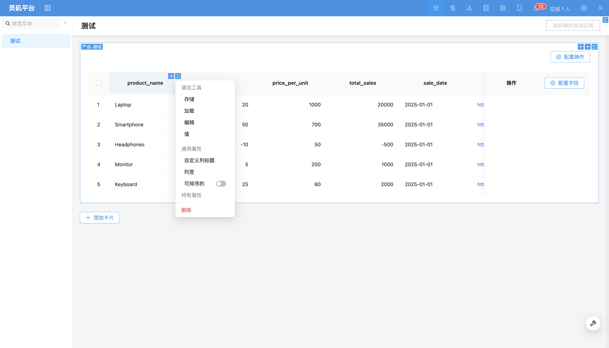
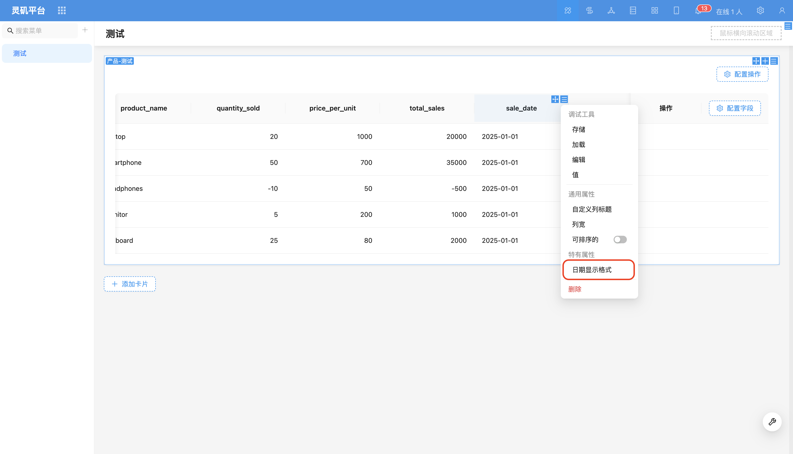
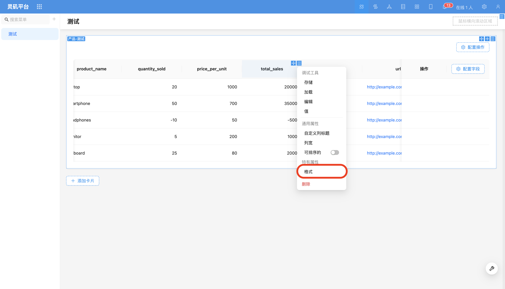
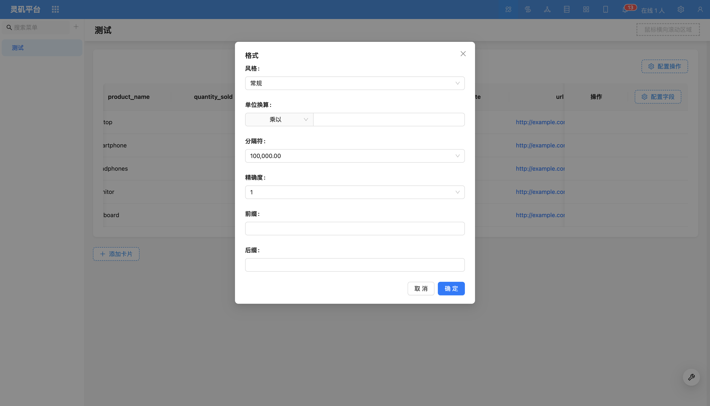
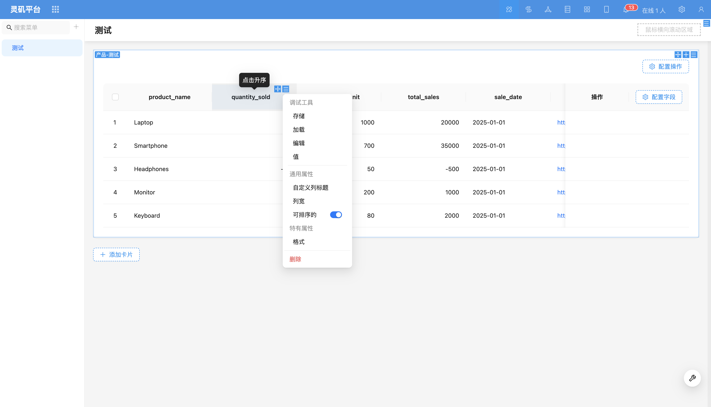

# 表格字段

### 概述

表格字段不仅支持调整列宽、字段标题和排序等基本操作，对于某些特定字段（如日期字段、关系字段、数值字段），还提供更多个性化的展示配置选项。

### 字段配置项

#### 日期字段格式化

更多操作参考 [日期格式化](../specific/date-picker.md)

#### 数值字段格式化

支持简单的单位换算、千分位分隔符、前后缀添加、精确度设置以及科学记数法展示。

更多操作参考 [数值格式化](../field-settings/number-format.md)

#### 排序

目前仅支持对单列进行排序，并且排序仅针对当前页的数据，暂不支持通过关系字段进行排序。

<!-- 固定列 -->

 <!-- 字段样式
支持部分类型切换为其他组件。例如，`URL` 组件可以切换为 `Preview` 组件。
如果需要扩展更多的组件，可以参考[扩展字段组件]()的相关内容。 -->

<!-- 样式

支持根据条件配置列的字体颜色和背景颜色。假设我们有一张银行交易明细表，其中一列是交易金额。我们希望将正数（收入）显示为绿色，负数（支出）显示为红色。具体操作步骤如下：

1. 打开交易金额字段的设置菜单，点击“风格”选项。

2. 点击“添加联动规则”，设置第一个规则：当交易金额大于0时，将字段颜色设置为绿色。

3. 再次点击“添加联动规则”，设置第二个规则：当交易金额小于0时，将字段颜色设置为红色。

最终效果如下所示： -->