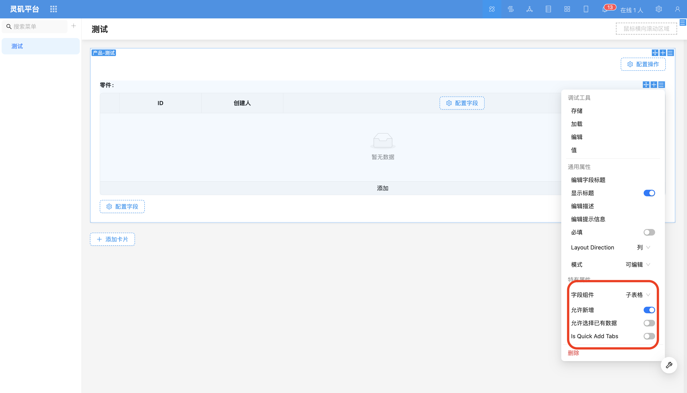
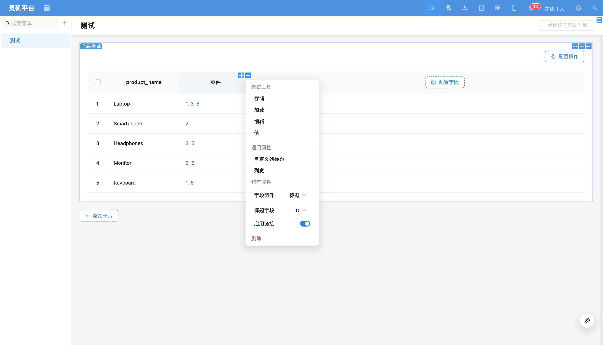

# 子表格

### 概述

子表格适用于处理对多关系字段，支持批量新建目标表数据后进行关联，或从已有数据中选择进行关联。

### 使用说明

- 字段显示与编辑
子表格中，不同类型的字段会显示不同的字段组件。对于大字段（如富文本、Json、多行文本等），将通过悬浮弹窗进行编辑。

- 关系字段
示例：订单（一对多）> 商品（一对多）> 库存。

<!-- TODO: 插入图片 -->

- 字段组件
关系字段组件默认是下拉选择器，但也支持数据选择器或子表单（弹窗）等其他组件。

<!-- TODO: 插入图片 -->

- 拖拽排序
支持对子表格内的数据进行拖拽排序。

<!-- TODO: 插入视频 -->

### 字段配置项

#### 允许选择已有数据（默认不开启）
可以从已有数据中选择并关联数据。

<!-- TODO: 插入图片 -->

#### 字段组件
支持切换为其他关系[字段组件](../field-settings/field-component.md)，如下拉选择、数据选择器等。

#### 联动规则

<!-- TODO: 插入视频 -->

适用于设置字段间的联动。
更多内容请参考 [联动规则](../../block/block-settings/linkage-rule.md)。

#### 允许解除已有数据关联

<!-- TODO: 插入视频 -->

支持解除与已关联数据的关联。