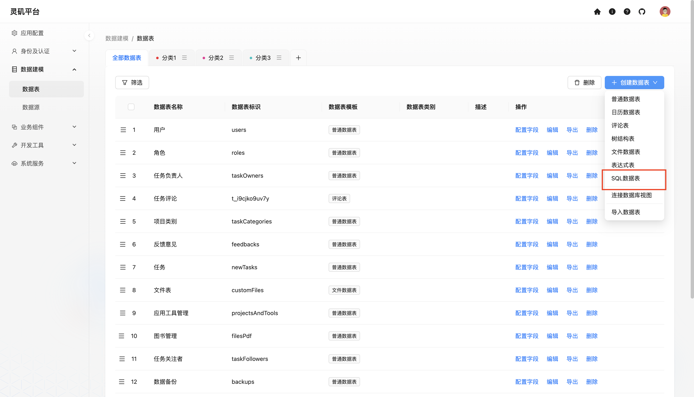

# SQL 数据表

::: info &#9432; 提示
该功能由插件 module-data-source 提供。
:::

### 介绍
SQL collection 通过 SQL 语句提取数据，并在配置字段元数据后，使用户能够像使用普通表一样，将其应用于表格、图表、工作流等场景，适用于关联查询、统计分析等需求。

### 使用手册

#### 新建

1. 在 SQL 输入框输入 SQL 语句并点击执行 (Execute) 后，系统会解析 SQL 语句，识别其中使用的表和字段，并从来源表中提取字段元数据。
<!-- TODO: 插入图片 -->
2. 如果系统自动解析的来源表和字段不正确，可以手动指定对应的表和字段，以确保使用正确的字段元数据。在操作时，需要先选择来源表，随后才能在字段来源中选择该表的字段。
<!-- TODO: 插入图片 -->
3. 如果字段没有对应的来源字段，系统会根据数据类型自动推断字段类型。若推断结果不准确，用户可以手动调整字段类型，以确保数据正确解析和使用。
<!-- TODO: 插入图片 -->
4. 在配置字段时，预览区域会同步显示相应的展示效果，方便用户直观检查和调整字段设置。
<!-- TODO: 插入图片 -->
5. 配置完成并确认无误后，需要点击 SQL 输入框下方的 确认 (Confirm) 按钮，以完成最终提交。
<!-- TODO: 插入图片 -->
#### 编辑

1. 当 SQL 语句发生变化时，可以点击“修改” (Edit) 按钮直接编辑 SQL 语句并重新配置字段。

2. 若需修改字段元数据，可以通过“配置字段” (Configure fields) 进行操作，类似于普通表的字段配置。

#### 同步

1. 当 SQL 语句未发生变化但数据库表结构有变更时，可以通过点击“配置字段” (Configure fields) - “从数据库同步” (Sync from database) 来同步和配置字段。
<!-- TODO: 插入图片 -->

#### SQL数据表对比连接数据库试图

|数据表类型|使用场景|实现原理|增删改支持|
|:---------:|:------:|:-------:|:--------:|
|SQL数据表| 模型较简单且适用于轻量级场景; 不方便操作数据库; 不想维护; 试图希望能够完全通过用户界面(UI)进行操作|SQL子查询|不支持|
|数据库视图| 数据库需要较为良好且稳定; 有数据库交互需求; 修改数据需求; 模型较为复杂 |数据库视图|支持部分|

::: warning WARNING
在使用 SQL 表时，请选择在灵矶中可管理的数据表。如果选择同一数据库下未接入灵矶的其他表，可能会导致 SQL 语句解析不准确。如果有这种需求，可以考虑通过创建视图并进行连接。
:::
